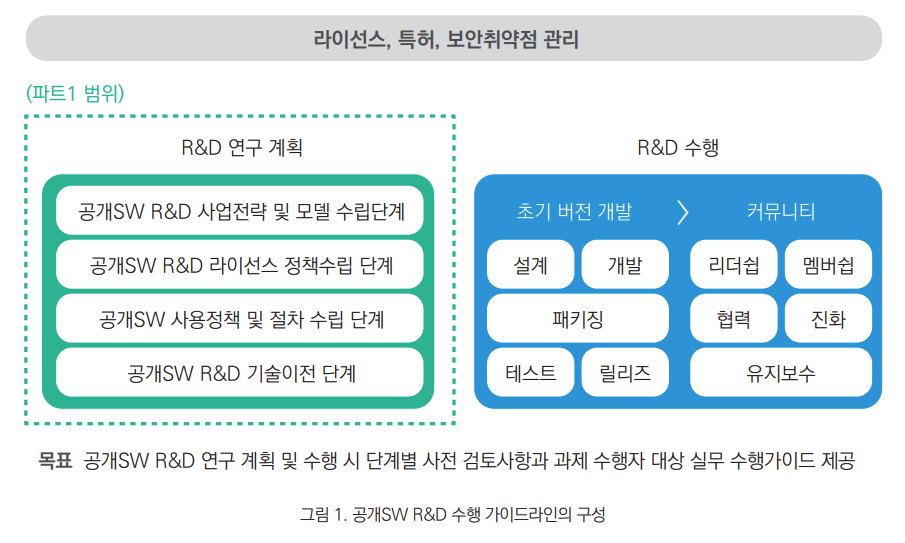

# 가이드의 대상 및 구성

 공개SW R&D 수행 가이드 라인의 목적은 공개SW R&D를 계획하고 수행하는 기업 및 연구소, 대학의 연구책임자 및 연구원들을 대상으로 [파트1](#)에서는 공개SW R&D 수행 전 연구계획 단계에서의 정책수립 시 검토해야 하는 사항을 제공하고, [파트2](#)에서는 실제 공개SW R&D를 수행 단계에서의 실무 검토사항을 제공하는 목적을 가진다.

공개SW R&D 수행 가이드 라인은 [그림1](과 같이 공개SW R&D 연구계획 수립단계와 공개SW R&D 수행 단계로 구성되어 있으며 본 가이드라인은 이 중 공개SW R&D를 수행하기에 앞서 반드시 검토해야 할 단계별 정책검토 사항을 제시함에 있다. 

공개SW R&D 연구계획 수립단계에서 검토해야 할 정책 검토사항은 공개SW R&D 사업전략 및 모델 수립, 공개SW R&D 라이선스 정책수립, 공개SW 사용정책 및 절차 수립, 공개SW R&D 기술이전 검토사항이다. 

공개SW R&D 수행에 관련된 내용은 [파트2]의 내용을 참조할 수 있다.  
 
>라이선스, 특허, 보안취약점 관리 

 

# 용어정리

- ### 저작권 (Copyright)
    저작자가 자신이 저작한 저작물을 독점적으로 이용하거나 이를 남에게 허락할 수 있는 인격적· 재산적 권리. 저작물의 복제·번역·상연·상영·전시·방송·대여 등을 내용으로 한다.  
    (출처: https://ko.wikipedia.org/wiki/저작권)  
 

- ### 공개SW (Open Source Software)
    저작권이 있으면서 저작권자가 소스 코드를 공개해 누구나 특별한 제한 없이
    해당 코드를 복제, 사용, 배포, 수정, 활용할 수 있는 소프트웨어를 말한다.  
    적용된 라이선스에 따라 자유 소프트웨어 (Free Software), 오픈소스 소프트웨어로 구분되지만 본 가이드에서는 오픈소스 (Open Source Software, 오픈소스 소프트웨어)로 통일하여 지칭한다.  
    (출처: https://ko.wikipedia.org/wiki/오픈소스_소프트웨어)  
 

- ### 라이선스 (License)  
    저작권을 가진 저작자가 타인에게 특정한 조건 하에 저작물을 사용할 수 있도록 허용하는
    계약을 말한다. (출처: https://ko.wikipedia.org/wiki/소프트웨어_사용권)
    라이선스 양립성 (License Compatibility) : 호환성이라고도 하며 복수의 저작물에 적용된 상이한 라이선스가
    새로운 저작물을 만들기 위하여 해당 저작물들의 소스 코드나 내용물을 결합시키는 것을 불가능하게 만드는 조건을
    포함할 때 발생하는 문제이다. “적어도 두 패키지 중 한 저작자의 직접적인 허가가 없이는 두 패키지의 결합을 합법적 으로 배포할 수 없는 경우＂두 개의 라이선스는 호환되지 않는다 또는 양립할 수 없다고 말한다.
    (출처: https://ko.wikipedia.org/wiki/라이선스_호환성)      
   
  
- ### 듀얼 라이선스 
    다중 라이선스 (영어: multi-licensing)는 컴퓨터 소프트웨어를 둘 이상의 각기 다른 조항과 조건으로
    배포하는 행위이다. 이는 여러 개의 각기 다른 사용권이나 사용권 집합을 의미할 수 있다. 듀얼 라이선스(dual license)는 소프트웨어가 두 개의 각기 다른 사용권에서 배포되는 것을 의미한다.  
    (출처: https://ko.wikipedia.org/wiki/다중_라이선스)  
   

- ### 배포 (Distribute)
    오픈소스가 포함된 소프트웨어를 단지 실행 및 사용하지 않고 유상이든 무상이든 제3자에게 전달하는 행위를  말한다.  
   

- ### 서비스 (Service)
    오픈소스가 포함된 소프트웨어를 단지 실행 및 사용하지 않고 서버 기반으로 네트워크를 이용해
    제3자에게 서비스를 제공하는 행위를 말한다.
    소스코드 (Source Code) : 원시코드라고도 하며, 컴퓨터 프로그램을 사람이 읽을 수 있는 프로그래밍 언어로 기술한 텍스트 파일이다.  
    (출처: https://ko.wikipedia.org/wiki/소스_코드)
